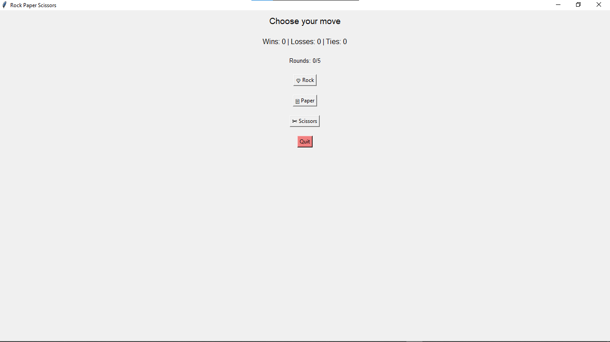
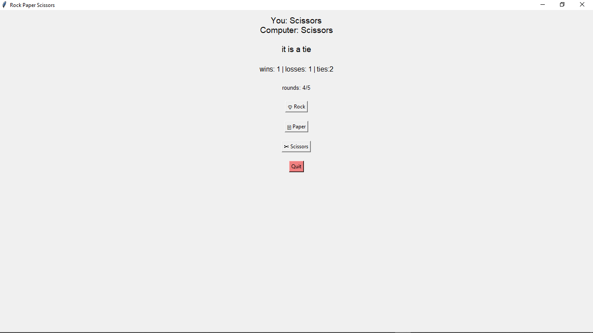
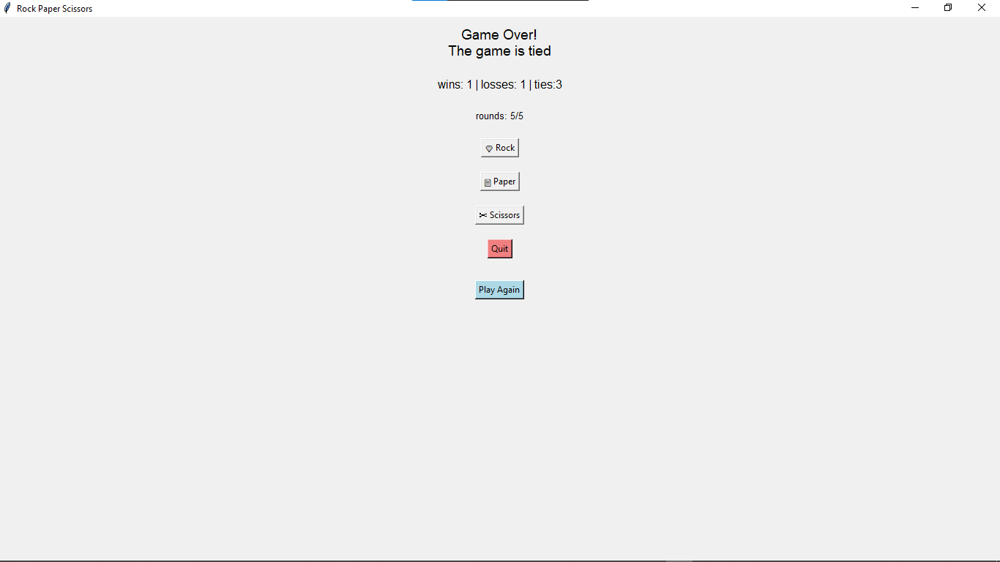

# Rock Paper Scissors Game

A graphical rock-paper-scissors game built with Python and Tkinter.

## Description

This is a GUI-based implementation of the classic rock-paper-scissors game where you play against the computer. The game tracks your score across 5 rounds and declares an overall winner at the end.

## Features

- **Graphical Interface:** Clean and simple UI with buttons for each move
- **Score Tracking:** Keeps track of wins, losses, and ties
- **Round Limit:** Play exactly 5 rounds per game
- **Game Summary:** Shows who won overall after all rounds complete
- **Play Again:** Reset button appears after game ends to start a new game
- **Quit Option:** Exit the game anytime with the quit button

## How to Play

1. Run the program
2. Click one of the three buttons: 🪨 Rock, 📄 Paper, or ✂️ Scissors
3. The computer makes its choice randomly
4. Results are displayed immediately
5. Play continues for 5 rounds
6. After 5 rounds, an overall winner is declared
7. Click "Play Again" to start a new game

## Game Rules

- Rock beats Scissors
- Scissors beats Paper
- Paper beats Rock
- Same choices result in a tie

## Requirements

- Python 3.x
- Tkinter (included with standard Python installation)

## Installation & Running

1. Make sure Python 3.x is installed on your system
2. Download or clone the `rps_gui.py` file
3. Run the program:
```bash
python rps_gui.py
```

No additional dependencies needed!

## What I Learned

Building this project helped me learn:
- Tkinter basics (windows, buttons, labels)
- Event handling with button clicks
- Dynamically updating GUI elements
- Managing application state (scores, rounds)
- Using dictionaries for game logic
- Showing/hiding widgets conditionally

## Future Improvements

Possible enhancements:
- Add sound effects
- Include images instead of emojis
- Add animations
- Let user choose number of rounds
- Add difficulty levels
- Save high scores

## Screenshots

### Start Screen


### Gameplay


### Game Over


## Author

Adekunle Oreoluwa,
Created while learning Tkinter GUI programming.
