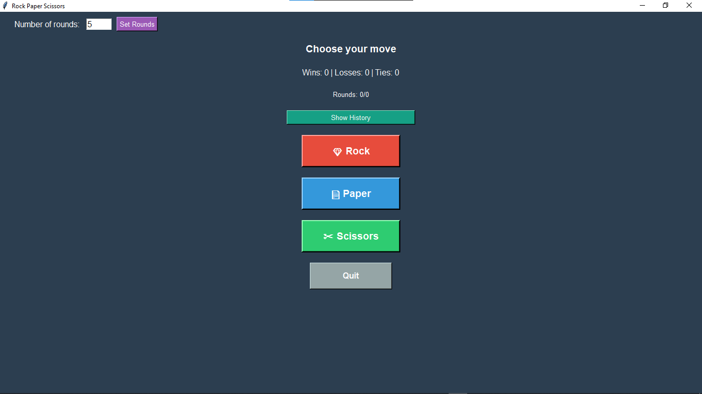
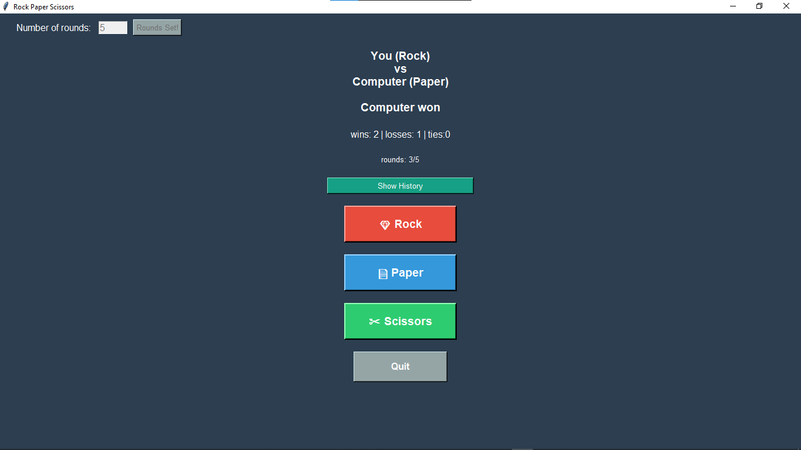
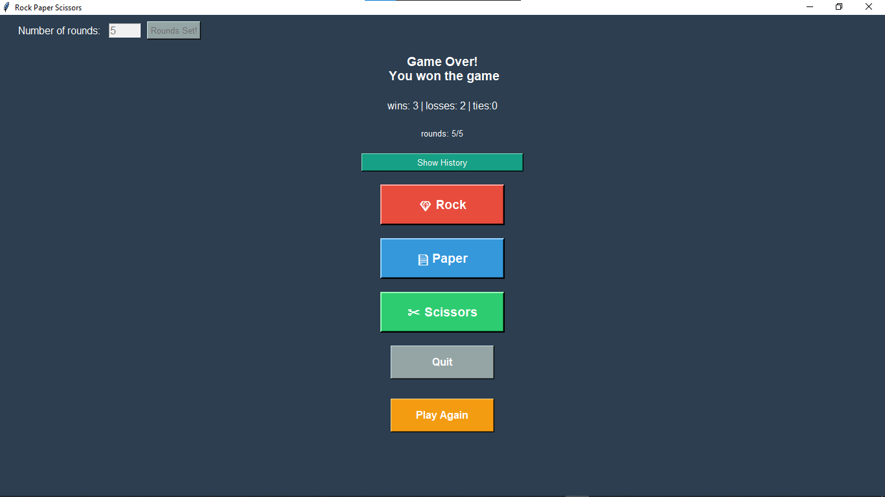
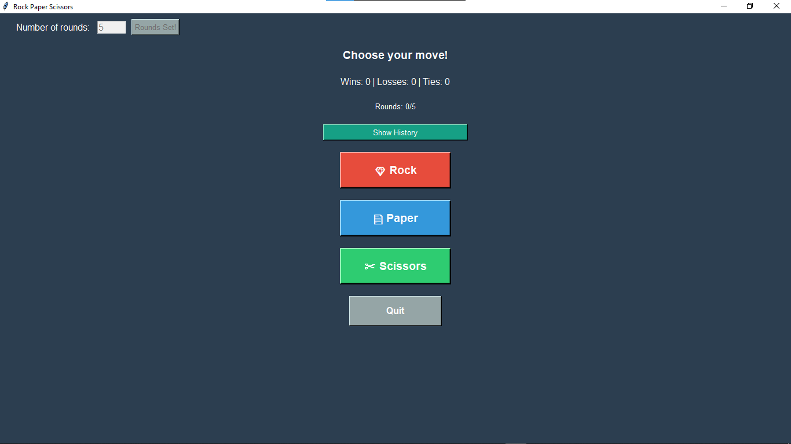
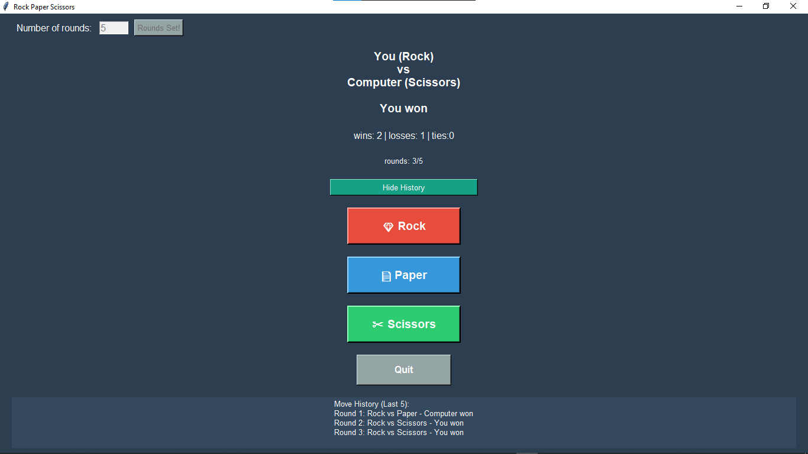

# Rock Paper Scissors Game

A graphical rock-paper-scissors game built with Python and Tkinter.

## Description

This is a GUI-based implementation of the classic rock-paper-scissors game where you play against the computer. The game tracks your score across a number of  rounds and declares an overall winner at the end.

## Features

- **Graphical Interface:** Clean and simple UI with buttons for each move
- **Score Tracking:** Keeps track of wins, losses, and ties
- **Round Limit:** Round limit can be set but a  maximum of 20 rounds per game, 
- **Game Summary:** Shows who won overall after all rounds complete
- **Play Again:** Reset button appears after game ends to start a new game
- **Quit Option:** Exit the game anytime with the quit button
- **Move history:** Shows the previous 5 rounds on toggle


## How to Play

1. Run the program
2. Click one of the three buttons: 🪨 Rock, 📄 Paper, or ✂️ Scissors
3. The computer makes its choice randomly
4. Results are displayed immediately
5. Play continues for set rounds
6. After set rounds, an overall winner is declared
7. Click "Play Again" to start a new game

## Game Rules

- Rock beats Scissors
- Scissors beats Paper
- Paper beats Rock
- Same choices result in a tie


## Prerequisites

- Python 3 installed on your Mac
- Git installed (comes pre-installed on most Macs)

## First Time Setup (Mac)

Follow these steps once to get the game running:

### Step 1: Open Terminal
- Press `Command + Space`
- Type "Terminal" and press Enter

### Step 2: Navigate to where you want the game
```bash
cd Desktop
```
(You can use any folder you prefer - Desktop, Documents, etc.)

### Step 3: Clone this repository
```bash
git clone https://github.com/oreoluwadekunle/python-tkinter-projects.git
```

### Step 4: Enter the game folder
```bash
cd  python-tkinter-projects
cd  rock-paper-scissors
```

### Step 5: Make the launcher executable
#### For Mac
```bash
chmod +x run_game.command
```

### Step 6: Close Terminal
You're done with Terminal! You'll never need it again.

---

## How to Start

Simply **double-click `run_game.command`** to start the game!

**First time only:** macOS may ask "Are you sure you want to open this?" - click "Open"

The launcher will automatically:
- Check for the latest updates
- Download any new changes
- Launch the game

## Updates

When I update the game, you don't need to do anything special! Just double-click `run_game.command` as usual, and it will automatically download the latest version before running.

## Troubleshooting

If the game doesn't start:
1. Make sure Python 3 is installed: Open Terminal and type `python3 --version`
2. Make sure you ran `chmod +x run_game.command` in the setup
3. Try right-clicking `run_game.command` and selecting "Open"

---

Enjoy the game! 🎮


## What I Learned

Building this project helped me learn:
- Tkinter basics (windows, buttons, labels)
- Event handling with button clicks
- Dynamically updating GUI elements
- Managing application state (scores, rounds)
- Using dictionaries for game logic
- Showing/hiding widgets conditionally

## Future Improvements

Possible enhancements:
- Add sound effects
- Include images instead of emojis
- Add animations
- Add difficulty levels
- Save high scores

## Screenshots

### Start Screen


### Gameplay


### Game Over


### Round Set


### History Toggle


## Author

Adekunle Oreoluwa,
Created while learning Tkinter GUI programming.
